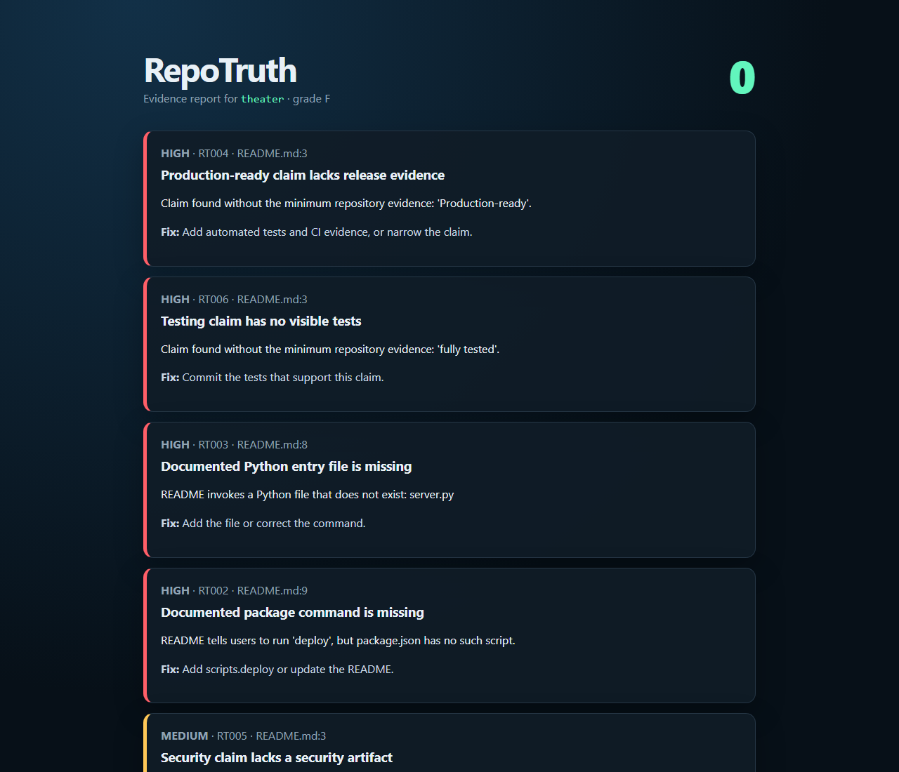

# RepoTruth

[](https://github.com/flokiss42-source/repotruth/actions/workflows/test.yml)
[](https://www.python.org/)
[](LICENSE)

**Does the code actually do what the README promises?**

RepoTruth is an evidence-first static analyzer for GitHub repositories. It catches broken setup commands, missing files, unimplemented code, and bold claims that have no visible evidence in the repository.

It is designed for maintainers reviewing fast-moving and AI-generated projects. RepoTruth treats every scanned file as untrusted data and never executes commands from the target repository.



## What it detects

| Rule | Mismatch |
|---|---|
| `RT000` | README is missing |
| `RT001` | Local documentation link is broken or escapes the repository |
| `RT002` | Documented npm/pnpm/yarn script does not exist |
| `RT003` | Documented Python entry file does not exist |
| `RT004` | “Production-ready” without tests and CI |
| `RT005` | Security claim without a policy, threat model, or security tests |
| `RT006` | Testing claim without committed tests |
| `RT007` | MIT license claim without a license file |
| `RT008` | TODO, FIXME, or `NotImplementedError` in implementation code |
| `RT009` | An explicit Evidence Contract lost its required files |
| `RT010` | RepoTruth configuration is invalid |

## Evidence Contracts

Heuristic rules find suspicious mismatches. Evidence Contracts go further: they let maintainers make an important claim executable.

Create `.repotruth.json`:

```json
{
  "contracts": [
    {
      "id": "cross-platform",
      "claim": "Runs on Windows, Linux, and macOS",
      "evidence": [
        ".github/workflows/test.yml",
        "tests/test_cli.py"
      ],
      "require": "all",
      "severity": "high"
    }
  ],
  "ignore": [
    { "rule": "RT008", "path": "generated/**" }
  ]
}
```

If a later pull request deletes the workflow or test, the claim remains visible but its evidence contract breaks the build. Glob patterns are supported, and `require` accepts `all` or `any`.

## Thirty-second demo

No installation is required from a clone:

```bash
python -m repotruth tests/fixtures/theater --no-color --fail-on none
```

Expected summary:

```text
RepoTruth F  score=0/100  findings=8
```

Generate a standalone visual report:

```bash
python -m repotruth tests/fixtures/theater --format html --output report.html --fail-on none
```

## Install as a CLI

```bash
python -m pip install .
repotruth .
```

Supported formats are terminal, JSON, SARIF 2.1.0, GitHub workflow annotations, and standalone HTML:

```bash
repotruth . --format json
repotruth . --format sarif --output repotruth.sarif
repotruth . --format html --output report.html
repotruth . --format github
```

Exit code `1` is returned when a finding meets `--fail-on`. The default threshold is `high`.

## GitHub Action

```yaml
name: repository-truth
on: [push, pull_request]

jobs:
  verify:
    runs-on: ubuntu-latest
    steps:
      - uses: actions/checkout@v4
      - uses: flokiss42-source/repotruth@main
        with:
          fail-on: high
```

The action produces `repotruth.sarif`, which can be uploaded to GitHub code scanning in repositories where SARIF upload is available.

## Philosophy

RepoTruth does not decide whether a project is good. It asks a narrower, testable question: **can a reader find evidence for what the repository tells them to believe?**

The score is intentionally explainable. High, medium, low, and informational findings subtract 18, 8, 3, and 1 points respectively. A clean scan means that the implemented rules found no mismatch; it is not a security certification.

## Safety and limitations

- Target code and README commands are never executed.
- HTML output escapes repository-controlled text.
- Rules favor evidence over probabilistic AI judgments.
- Static analysis can produce false positives and cannot prove correctness.
- Scan untrusted repositories in an isolated environment anyway; other developer tools may execute hooks or extensions.

See [Security policy](SECURITY.md) and [contribution guide](CONTRIBUTING.md).

## Development

```bash
python -m unittest discover -s tests -v
python -m repotruth tests/fixtures/honest --no-color
python -m repotruth tests/fixtures/theater --no-color --fail-on none
```

RepoTruth is MIT licensed.
