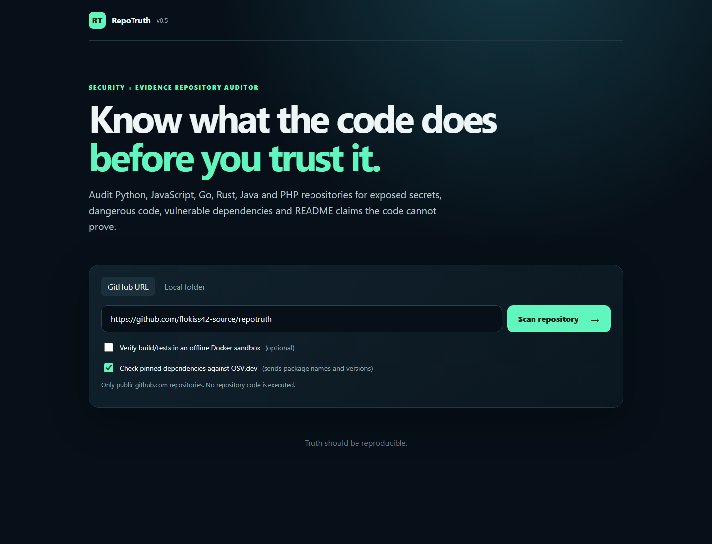
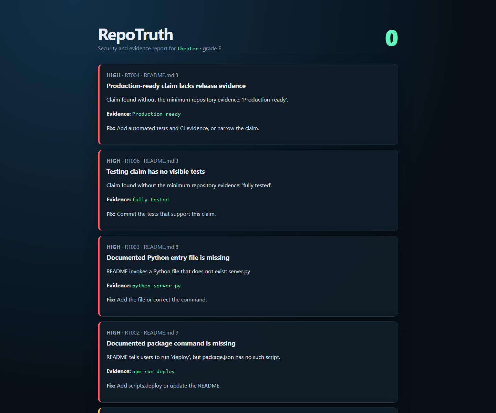

# RepoTruth

[](https://github.com/flokiss42-source/repotruth/actions/workflows/test.yml)
[](https://www.python.org/)
[](LICENSE)

**Know what unfamiliar code does before you trust or run it.**

RepoTruth is an explainable security and evidence auditor for GitHub repositories. It catches exposed credentials, risky code execution, unsafe deserialization, suspicious install scripts, dependency drift, known vulnerable packages, broken setup commands, and bold claims that have no visible evidence.

It is designed for maintainers, buyers, and developers reviewing unfamiliar or AI-generated projects. Static scanning never executes target code. Optional runtime verification is explicit and runs only inside a locked-down offline Docker container.



<details>
<summary>Example evidence report</summary>



</details>

## Browser interface

On Windows, double-click `start-repotruth.bat`. The local interface opens in your browser. Paste a public GitHub URL or switch to **Local folder**, enter a path, and press **Scan repository**. The OSV option checks pinned package versions against the public vulnerability database. The Docker option is separate and never silently runs code.

On any platform:

```bash
python -m repotruth serve --open
```

The web server listens on `127.0.0.1:8765` only. Remote scans accept public `https://github.com/owner/project` URLs and enforce time and size limits.

## Real-world calibration

Version 0.5 was calibrated with static scans of public repositories across six ecosystems. Runtime execution remained disabled for intentionally vulnerable targets.

| Repository | Ecosystem | Result |
|---|---|---:|
| [psf/requests](https://github.com/psf/requests) | Python | A · 92 |
| [expressjs/express](https://github.com/expressjs/express) | Node.js | A · 90 |
| [go-chi/chi](https://github.com/go-chi/chi) | Go | A · 94 |
| [serde-rs/json](https://github.com/serde-rs/json) | Rust | A · 100 |
| [OWASP Juice Shop](https://github.com/juice-shop/juice-shop) | intentionally vulnerable Node.js | F · 23 |
| [OWASP WebGoat](https://github.com/WebGoat/WebGoat) | intentionally vulnerable Java | F · 0 |
| [OWASP NodeGoat](https://github.com/OWASP/NodeGoat) | intentionally vulnerable Node.js | F · 0 |
| [DVWA](https://github.com/digininja/DVWA) | intentionally vulnerable PHP | F · 22 |

These scores describe the evidence visible to RepoTruth at the tested revisions. They are regression signals, not endorsements or security certifications.

## What it detects

| Rule | Mismatch |
|---|---|
| `RT000` | README is missing |
| `RT001` | Local documentation link is broken or escapes the repository |
| `RT002` | Documented npm/pnpm/yarn script does not exist |
| `RT003` | Documented Python entry file does not exist |
| `RT004` | “Production-ready” without tests and CI |
| `RT005` | Security claim without a policy, threat model, or security tests |
| `RT006` | Testing claim without committed tests |
| `RT007` | MIT license claim without a license file |
| `RT008` | TODO, FIXME, or `NotImplementedError` in implementation code |
| `RT009` | An explicit Evidence Contract lost its required files |
| `RT010` | RepoTruth configuration is invalid |
| `RT100` | Credential or private key appears committed (evidence is redacted) |
| `RT110` | Dynamic code execution such as `eval` or `exec` |
| `RT111` | Potentially unsafe deserialization |
| `RT112` | Shell execution or `shell=True` |
| `RT113` | TLS certificate verification disabled |
| `RT114` | Java dynamic script evaluation |
| `RT115` | PHP request-controlled file inclusion |
| `RT116` | PHP request data reaches a SQL query |
| `RT120` | npm lifecycle code runs automatically during installation |
| `RT121` | Floating or non-registry JavaScript dependency |
| `RT122` | JavaScript dependency lockfile is missing |
| `RT123` | Python dependency is not exactly pinned |
| `RT130` | Large high-entropy encoded payload in source |
| `RT140` | Pinned dependency matches a known OSV advisory |
| `RT200` | Test/build command failed in the Docker sandbox |
| `RT201` | Sandbox verification timed out |

## Evidence Contracts

Heuristic rules find suspicious mismatches. Evidence Contracts go further: they let maintainers make an important claim executable.

Create `.repotruth.json`:

```json
{
  "contracts": [
    {
      "id": "cross-platform",
      "claim": "Runs on Windows, Linux, and macOS",
      "evidence": [
        ".github/workflows/test.yml",
        "tests/test_cli.py"
      ],
      "require": "all",
      "severity": "high"
    }
  ],
  "ignore": [
    { "rule": "RT008", "path": "generated/**" }
  ]
}
```

If a later pull request deletes the workflow or test, the claim remains visible but its evidence contract breaks the build. Glob patterns are supported, and `require` accepts `all` or `any`.

## Thirty-second demo

No installation is required from a clone:

```bash
python -m repotruth tests/fixtures/theater --no-color --fail-on none
```

Expected summary:

```text
RepoTruth F  score=0/100  findings=8
```

Generate a standalone visual report:

```bash
python -m repotruth tests/fixtures/theater --format html --output report.html --fail-on none
```

## Install as a CLI

```bash
python -m pip install .
repotruth .
```

Supported formats are terminal, JSON, SARIF 2.1.0, GitHub workflow annotations, and standalone HTML:

```bash
repotruth . --format json
repotruth . --format sarif --output repotruth.sarif
repotruth . --format html --output report.html
repotruth . --format github
repotruth . --online
repotruth . --verify-runtime
```

`--online` sends pinned package names and versions from npm, Python, Go, Rust, and Composer lock data to the public OSV.dev API. `--verify-runtime` requires Docker and an already downloaded `python:3.13-alpine` or `node:22-alpine` image. The container has no network, mounts the repository read-only, uses a non-root user, and has CPU, memory, PID, time, and temporary-storage limits.

## Safe fixes and pull requests

Preview new security scaffolding without changing anything:

```bash
repotruth fix .
```

Create only the proposed files, then review them:

```bash
repotruth fix . --apply
```

For a repository you control, `repotruth pr .` requires a clean worktree, creates a dedicated branch, commits only the generated files, pushes it, and asks GitHub CLI to open a pull request. This command changes Git and GitHub state, so it runs only when invoked explicitly.

Exit code `1` is returned when a finding meets `--fail-on`. The default threshold is `high`.

## GitHub Action

```yaml
name: repository-truth
on: [push, pull_request]

jobs:
  verify:
    runs-on: ubuntu-latest
    steps:
      - uses: actions/checkout@v6
      - uses: flokiss42-source/repotruth@main
        with:
          fail-on: high
```

The action produces `repotruth.sarif`, which can be uploaded to GitHub code scanning in repositories where SARIF upload is available.

## Philosophy

RepoTruth does not decide whether a project is good. It asks a narrower, testable question: **can a reader find evidence for what the repository tells them to believe?**

The score is intentionally explainable. High, medium, low, and informational findings subtract 18, 8, 3, and 1 points respectively. Repeated instances of one rule are capped at twice that rule's strongest finding weight, so one noisy pattern cannot dominate the entire score. A clean scan means that the implemented rules found no mismatch; it is not a security certification.

## Safety and limitations

- Static scans never execute target code or README commands.
- Runtime verification is opt-in and refuses to fall back to execution on the host.
- OSV checks are opt-in in the CLI and disclose exactly what metadata leaves the computer.
- HTML output escapes repository-controlled text.
- Rules favor evidence over probabilistic AI judgments.
- Static analysis and vulnerability databases can produce false positives and cannot prove correctness or safety.
- Scan untrusted repositories in an isolated environment anyway; other developer tools may execute hooks or extensions.

See [Security policy](SECURITY.md) and [contribution guide](CONTRIBUTING.md).

## Development

```bash
python -m unittest discover -s tests -v
python -m repotruth tests/fixtures/honest --no-color
python -m repotruth tests/fixtures/theater --no-color --fail-on none
```

RepoTruth is MIT licensed.
